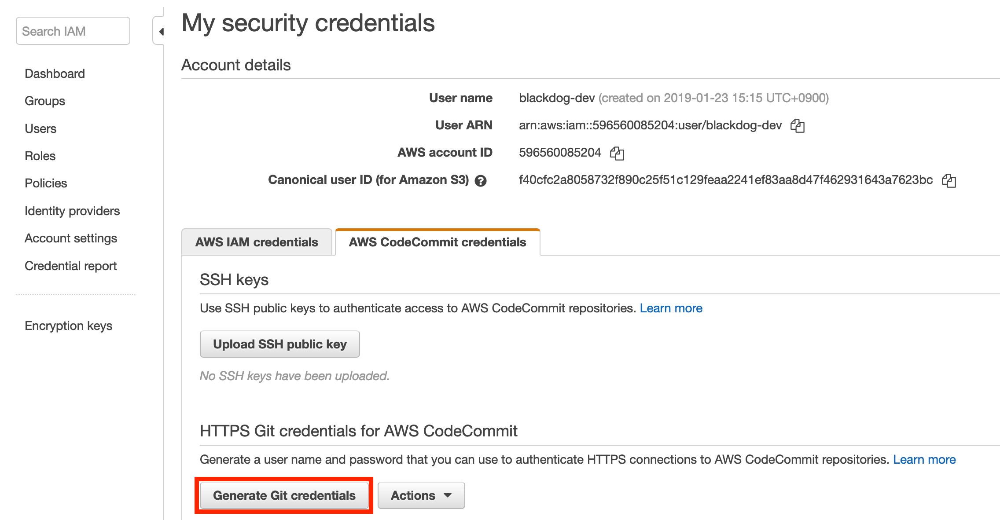
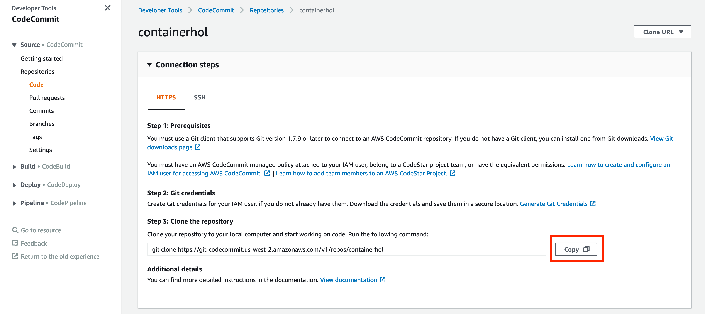

# CodeCommit

## CodeCommit 리포지토리 생성하기

1. 다음의 링크에서 [https://console.aws.amazon.com/codesuite/codecommit/home](https://console.aws.amazon.com/codesuite/codecommit/home) 에서 CodeCommit 콘솔을 엽니다.

2. Repositories 페이지에서 Create repository를 선택합니다.

3. 리포지토리 생성 페이지의 Name에 **container-hol-test**  등과 같이 입력합니다. 이미 존재하는 repository면 다른 이름을 넣어서 생성합니더.

4. (선택 사항) 설명에 리포지토리 설명을 입력합니다. 그러면 사용자들이 리포지토리의 용도를 식별하는 데 도움이 됩니다.

5. Create를 버튼을 클릭하여 리포지토리를 생성합니다.

## Code Commit에서 사용할 HTTPS Git Credential(자격증명) 생성하기

> CodeCommit에 엑세스하기 위한 IAM 사용자를 생성 및 구성합니다. [아직 사용자에게 IAM 역활을 부여하지 않았다면 다음의 링크를 클릭하여 사전준비 사항을 수행하도록 합니다.](./../README#Prerequisites) 이 실습에서는 새롭게 생성한 사용자에게 Administrator Access를 부여하였기 때문에 CodeCommit에 대한 Access를 따로 추가하지 않아도 됩니다.

1. AWS Management 콘솔에 로그인한 [다음 링크를 클릭해서 IAM 콘솔을 엽니다](https://console.aws.amazon.com/iam/). CodeCommit 접속을 위해 Git 자격 증명을 생성 및 사용할 IAM 사용자로 로그인해야 합니다.

2. IAM 콘솔의 탐색 창에서 Users(사용자)를 선택하고 사용자 목록에5. 서 해당 IAM 사용자 기존에 작성하셨던 유저명 혹은 **containerhol-admin** 을 선택합니다.

3. AWS CodeCommit 자격 증명 탭을 선택합니다. 그리고 하단에 있는 Generate Git Credentials 버튼을 클립합니다.

     

4. IAM이 생성한 사용자 이름과 암호를 복사하는 방법은 로컬 컴퓨터에 있는 안전한 파일에 표시, 복사 후 붙여넣기하거나 자격 증명 다운로드를 선택하여 .CSV 파일로 이 정보를 다운로드하는 두 가지가 있습니다. CodeCommit에 접속하려면 이 정보가 필요합니다. Download credentials 버튼을 눌러서 CSV 파일로 저장해두록 합니다.

    

     > **이때가 사용자 이름과 암호를 저장할 수 있는 유일한 기회입니다.** 이 정보를 저장하지 않는 경우, 사용자 이름은 IAM 콘솔에서 복사할 수 있지만 암호는 찾을 수 없습니다. 그러므로 암호를 재설정한 후 저장해야 합니다.

## CodeCommit 콘솔 연결 및 리포지토리 복제

1. [https://console.aws.amazon.com/codesuite/codecommit/home](https://console.aws.amazon.com/codesuite/codecommit/home) 에서 CodeCommit 콘솔을 엽니다.

2. 오른쪽 상단에서 리전 선택메뉴에서 oregon 리전을 선택합니다. 리포지토리는 한 AWS 리전에 국한됩니다.

3. 목록에서 연결하려는 리포지토리명을 클릭합니다. 그러면 해당 리포지토리의 코드 페이지가 열립니다.

4. Step 3: Clone the repository 항목에 있는 명령어를 Copy버튼을 눌러서 복사합니다.

    

5. [Cloud9 대쉬보드 화면으로 이동하여](https://us-west-2.console.aws.amazon.com/cloud9/home?region=us-west-2) 앞에서 생성한 워크스페이스 항목에서 Open IDE 버튼을 눌러 개발환경을 엽니다.

6. 사용자의 홈 디렉토리로 아래의 environment로 이동합니다. Cloud9의 터미널에서 아래의 명령어를 실행합니다.

     ```bash
     cd ~/environment
     ```

7. 터미널 화면에서 위의 4에서 복사한 명령어를 붙여넣고 실행합니다. 그럼 다음과 같은 화면을 볼 수 있습니다.

     ```bash
     container-hol:~/environment $ git clone https://git-codecommit.us-west-2.amazonaws.com/v1/repos/containerhol
     Cloning into 'containerhol'...
     Username for 'https://git-codecommit.us-west-2.amazonaws.com':
     ```

8. Code Commit에서 사용할 HTTPS Git Credential(자격증명) 생성하기 항목에서 생성한 Git Credential 파일을 열어서 User Name과 Password를 보고 터미털에 복사해서 붙여넣기 합니다. 정상적으로 입력했다면 다음과 같은 화면을 볼 수 있습니다.

     ```bash
     warning: You appear to have cloned an empty repository.
     ```

9. 정상적으로 Code Commit 리포지토리를 생성하였으며 테스트를 완료했습니다.

## [다음: Code Commit Repository에 Dockefile 및 buildspec.yaml 추가하기](./create-resource-for-build)

## [메인페이지로 돌아가기](../README)

## [이전: Service 작성하여 서비스 배포하기](./create-service)
