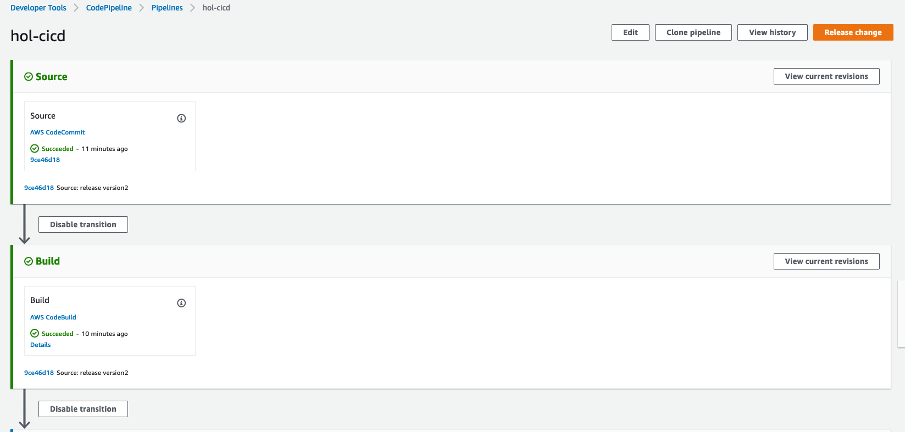
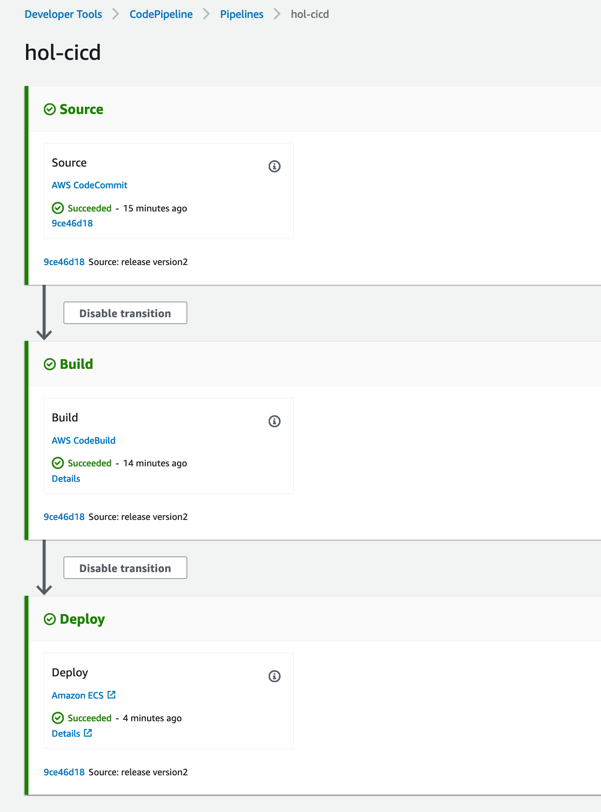

# Cope Pipeline을 생성하여 ECS에 지속적인 배포하기

    CodePipeline 마법사를 사용하여 파이프라인 단계를 생성하고, 소스 리포지토리를 ECS 서비스에 연결합니다.

## Code Pipeline으로 새로운 파이프라인 생성

1. [https://console.aws.amazon.com/codepipeline/](https://console.aws.amazon.com/codepipeline/) 에서 CodePipeline 콘솔을 엽니다.

2. 시작 페이지에서 Create Pipeline (파이프라인 생성) 을 선택합니다.

3. CodePipeline를 처음으로 사용하는 경우 Welcome 페이지 대신 소개 페이지가 나타납니다. 지금 시작을 선택합니다.

## 단계별로 입력하기

1. 이름 페이지의 파이프라인 이름 상자에 해당 파이프라인 이름을 입력한 후 다음 단계를 선택합니다. 이 자습서에서 파이프라인 이름은 **hol-cicd** 입니다. 나머지 항목은 디폴트로 둡니다.

2. Add Source Stage에서는 다음과 같이 입력을 하고 Next버튼을 누릅니다.

    - Source provider: **AWS CodeCommit**

    - Repository name: **containerhol**

    - Branch Name: **master**

    - Change detection options: **Amazon CloudWatch Events (Recommended)**

3. Add buil stage에서는 다음과 같이 입력을 하고 Next 버튼을 누릅니다.
  
    - Build provider: **AWS CodeBuild**
    - Region: **US West - (Oregon)**
    - Project name 오른쪽의 Create a new build project를 선택합니다. 빌드 프로젝트 생성시에는 다음과 같이 입력 및 선택을 하고 나머지는 디폴트로 둡니다
        - Project Name: hol-build
        - Environment Image: **Managed Image**
        - Operating System: **Ubuntu**
        - Runtime: **Standard**
        - Image: **aws/codebuild/standard:1.0**
        - **Privileged 옵션 체크**
        > Privileged 옵셥을 체크하지 않는다면 Code build에서 도커 이미지를 빌드할 수 없습니다
        - Continue to CodePipeline 버튼을 누릅니다
    - Add build stage 화면으로 돌아와 Next버튼을 누릅니다
        > 마법사가 빌드 프로젝트에 대해 codebuild-hol-build-service-role과 같은 형식으 CodeBuild 서비스 역할을 생성합니다. 이 역할 이름은 나중에 Amazon ECR 권한을 역할에 추가할 때 필요하므로 메모해 둡니다.

4. Add to deploy stage에서는 다음과 같이 입력을 합니다. 나머지는 디폴트로 남겨둡니다.
    - Deploy provider : **Amazon ECS**
    - Region: **US West - (Oregon)**
    - Cluster name: **ContainerHOL**
    - Service name: **hol-webapp-service**

5. 리뷰 페이지에서 파이프라인 구성을 검토하고 Create Pipeline(파이프라인 생성)을 선택하여 파이프라인을 생성합니다.

    > 이제 파이프라인이 생성되었으며 다른 파이프라인 단계에서 이 파이프라인이 실행하려고 시도합니다. 하지만 마법사가 만든 기본 CodeBuild 역할이 buildspec.yml 파일에 포함된 모든 명령을 실행할 수 있는 권한을 갖고 있지 않으므로 빌드 단계가 실패합니다. 다음 단계에서는 빌드 단계를 위한 권한을 추가합니다.

## CodeBuild 역할에 Amazon ECR 권한을 추가하기

1. [https://console.aws.amazon.com/iam/](https://console.aws.amazon.com/iam/)에서 IAM 콘솔을 엽니다.

2. 왼쪽 탐색 창에서 역할을 선택합니다.

3. 검색란에 codebuild-를 입력하고 CodePipeline 마법사가 생성한 역할을 선택합니다. 이 핸즈온랩에서의 역할이름은 **codebuild-hol-build--service-role**입니다.

4. Summary(요약) 페이지에서 Attach policies (정책 연결)을 선택합니다.

5. AmazonEC2ContainerRegistryPowerUser 정책 왼쪽의 상자를 선택하고 Attach policy ( 정책 연결 )을 선택합니다.

## 파이프라인 테스트하기

1. 다음의 링크로 [https://us-west-2.console.aws.amazon.com/codesuite/codepipeline/pipelines?region=us-west-2](https://us-west-2.console.aws.amazon.com/codesuite/codepipeline/pipelines?region=us-west-2) 이동하여 hol-cicd를 선택하고 오른쪽 상단의 release changes를 선택합니다.

    

2. 파이프라인이 배포까지 정상적으로 수행되면 다음고 같은 화면을 볼 수 있습니다.

    

3. 정상적으로 배포되었다면 [https://us-west-2.console.aws.amazon.com/ec2/v2/home?region=us-west-2#LoadBalancers:sort=loadBalancerName](https://us-west-2.console.aws.amazon.com/ec2/v2/home?region=us-west-2#LoadBalancers:sort=loadBalancerName) 에서 hol-alb를 선택한후에 Description 탭의 DNS name을 복사하여 웹 브라우저에 붙여넣고 "Hello World"가 정상적으로 뜨는지 확인합니다.

4. 이번에는 구성된 소스 리포지토리에 대한 코드를 변경하고 커밋한 후 변경 사항을 푸시합니다. Cloud9 워크 스페이스에서 다음과 같이 도커 파일을 수정해봅니다.

   - 다음과 같이 수정합니다.

    ```Dockerfile
    FROM nginx:latest
    RUN  echo '<h1>Hello World version2 </h1><' \
    >> index.html
    RUN cp /index.html /usr/share/nginx/html
    ```

5. Cloud9의 워크 스페이스에서 다음과 같은 명령어로 다시 소스를 커밋하고 푸쉬합니다.

   - 소스를 추가하고 커밋합니다.

    ```bash
    cd ~/containerhol
    git commit -am "modify html"
    ```

   - 커밋을 푸시합니다. 앞에서 Code Commit 리포지토리를 만들때 다운로드 받아뒀던 csv 파일을 참조하여 유저네임과 패스워드를 입력합니다.

    ```bash
    git config credential.helper store
    git push origin master
    ```

6. =정상적으로 푸쉬가 되었다면 commit hook으로 인하여 Code Pipeline이 자동으로 실행이 됩니다.

7. [https://us-west-2.console.aws.amazon.com/ec2/v2/home?region=us-west-2#LoadBalancers:sort=loadBalancerName](https://us-west-2.console.aws.amazon.com/ec2/v2/home?region=us-west-2#LoadBalancers:sort=loadBalancerName) 로 이동하여 hol-alb를 선택한후에 Description 탭의 DNS name을 복사하여 웹 브라우저에 붙여넣고 "Hello World version2 "가 정상적으로 뜨는지 확인합니다.

실습을 완료하였습니다.

## [메인페이지로 돌아가기](../README.md)

## [이전: Code Commit Repository에 Dockefile 및 buildspec.yaml 추가하기](create-resource-for-build.md)
