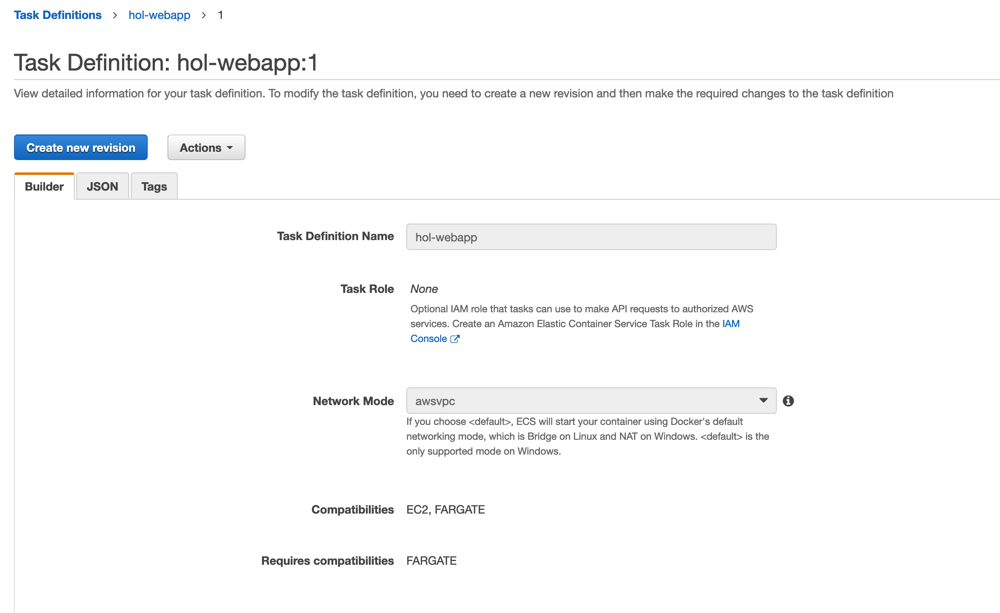

# Task Definition 생성하기

1. [https://console.aws.amazon.com/ecs/](https://console.aws.amazon.com/ecs/) 에서 Amazon ECS 콘솔을 엽니다.

2. 왼쪽 탐색 창에서 Task Definitions(작업 정의), Create new Task Definition(새 작업 정의 생성)을 차례대로 선택합니다.

3. Select compatibilities(호환성 선택) 페이지에서 **EC2**를 선택하고 Next step 버튼을 누릅니다.

4. 화면을 아래로 스크롤 해서 Configure via json 버튼을 누릅니다.

    

5. 에디터를 열어서 아래의 파일의 YOUR_ACCOUNT_ID 를 여러분의 계정 ID ( 숫자 ) 로 변경하고 YOUR_IMAGE_URI 는 앞의 실습에서 생성한 ECR 리포지토리 URI를 입력합니다.

    ```json
    {
    "executionRoleArn": "arn:aws:iam::<YOUR_ACCOUNT_ID>:role/ecsTaskExecutionRole",
    "containerDefinitions": [{
        "name": "hol-webapp",
        "image": "<YOUR_IMAGE_URI>",
        "essential": true,
        "portMappings": [{
        "hostPort": 80,
        "protocol": "tcp",
        "containerPort": 80
        }]
    }],
    "requiresCompatibilities": [
        "FARGATE"
    ],
    "networkMode": "awsvpc",
    "cpu": "256",
    "memory": "512",
    "family": "hol-webapp"
    }
    ```

6. 실제로 잘 작성된 json 파일은 다음과 같습니다. 띄워쓰기 및 쌍따옴표를 생략하지 않도록 주의합니다.

    ```json
    {
    "executionRoleArn": "arn:aws:iam::xxxxxxxxxxxx:role/ecsTaskExecutionRole",
    "containerDefinitions": [{
        "name": "hol-webapp",
        "image": "xxxxxxxxxxxx.dkr.ecr.us-west-2.amazonaws.com/containerhol/webapphol",
        "essential": true,
        "portMappings": [{
        "hostPort": 80,
        "protocol": "tcp",
        "containerPort": 80
        }]
    }],
    "requiresCompatibilities": [
        "FARGATE"
    ],
    "networkMode": "awsvpc",
    "cpu": "256",
    "memory": "512",
    "family": "hol-webapp"
    }
    ```

7. 팝업창에 위에서 작성한 json 포맷의 파일을 붙여넣고 save 버튼을 누릅니다.

8. 정상적으로 json파일이 입력됐다면 Create 버튼을 눌러 task definition을 생성합니다.

9. 완료가 되면 다음과 같은 화면을 확인할 수 있습니다. 각 항목을 보고 원하는 스펙으로 생성이 됐는지 확인을 해봅니다.

    

## [다음: Service에서 사용할 Application Load Balancer 생성하기](./create-alb)

## [메인페이지로 돌아가기](../README)

## [이전: ECR 클러스터 생성하기](./create-ecr-cluster)
